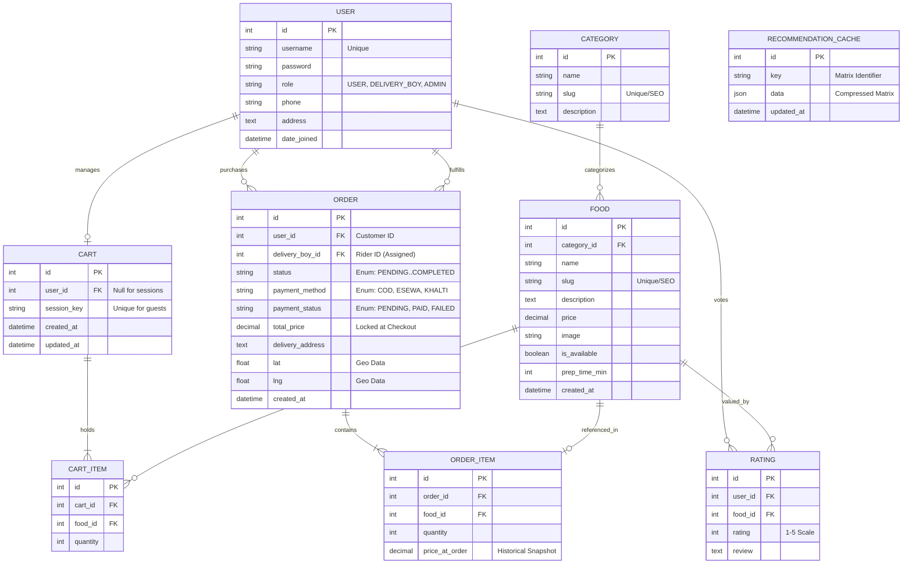
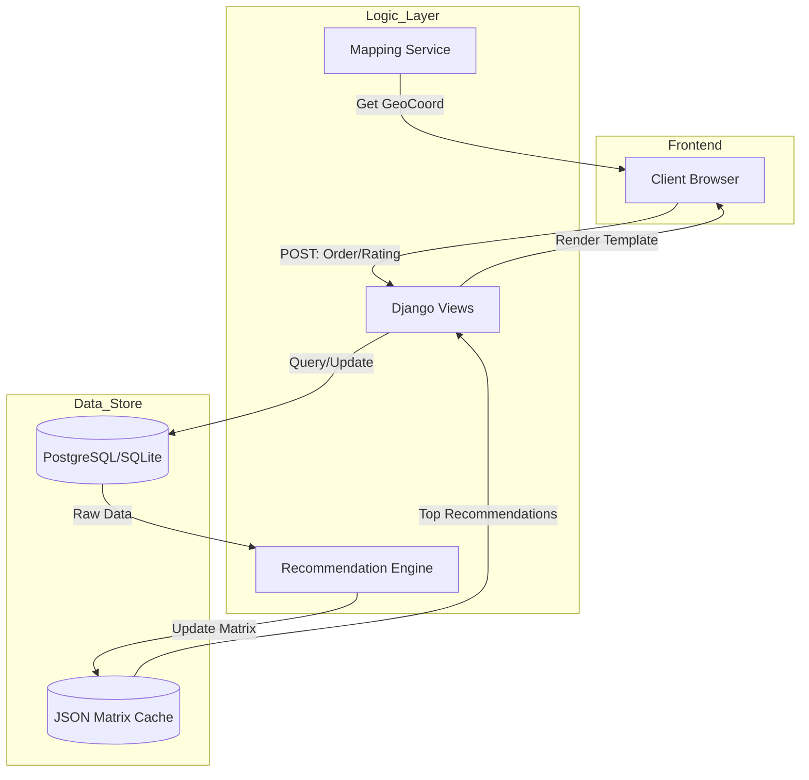
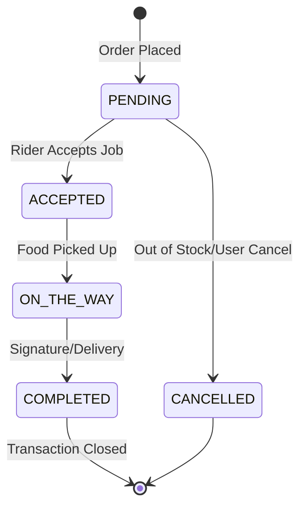
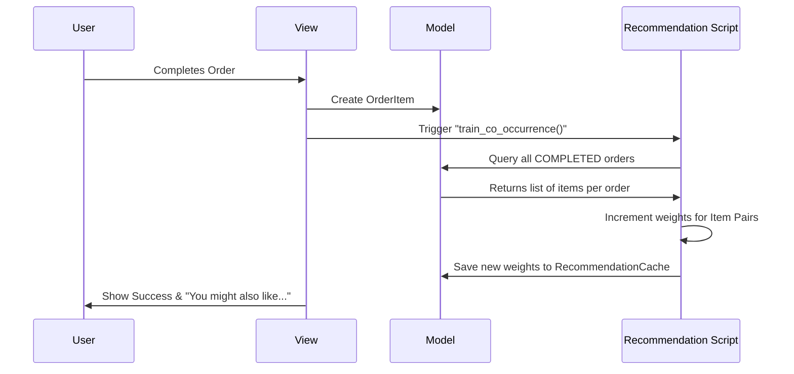

# Khaja Kham - Comprehensive Technical Masterfile

## 1. System Architecture & Model Analysis
The Khaja Kham project is architected using a decoupled application strategy (Core, Foods, Orders, Users, Recommendations). Below is the granular analysis of the schema.

### 1.1 Model Granularity
| Entity | Logic & Neglected Parts | Scalability Factor |
| :--- | :--- | :--- |
| **User (Custom)** | Distinguishes between 3 roles. **Neglected Part**: Includes `address` and `phone` which are critical for Rider navigation but often missed in basic auth systems. | Can be extended for Merchant roles. |
| **Order** | Handles geospatial data (`lat`, `lng`) and a `delivery_boy` FK. **Neglected Part**: Specifically tracks `total_price` as a static field to prevent data drift. Now includes `payment_method` (COD, eSewa, Khalti) and `payment_status` for financial reconciliation. | Ready for GIS analysis and payment gateway integration. |
| **OrderItem** | **Neglected Part**: Uses `price_at_order`. This is a professional business requirement to ensure historical receipts remain accurate even if the menu price is updated. | Supports financial auditing. |
| **Food & Category** | Uses `slug` for SEO-friendly URLs. Includes `prep_time_min` for delivery window estimation. | Ready for multi-branch scaling. |

---

## 2. Advanced Mermaid ERD (Technical Level)
This diagram includes every field, relationship type, and key constraint.

---

## 3. Dynamic Workflow Diagrams

### 3.1 Data Flow Diagram (DFD) - Level 1
This shows how data moves between storage layers and user interfaces.

### 3.2 Order Lifecycle (Activity Diagram)
A high-resolution view of the state transitions.

### 3.3 Sequence Diagram (The Logic Flow)
How the "People also ordered" logic actually triggers.

---

## 4. Algorithmic Purpose & Definitions
1.  **Collaborative Filtering**: Used for **Personalization**. It solves the "Discovery Problem" - helping users find new food they didn't know they wanted.
2.  **Breadth-First Geolocation**: Used for **Logistics**. By mapping coordinates directly to the Rider dashboard, we solve the "Last-Mile Delivery" problem common in local food delivery.
3.  **Atomic Pricing**: By taking a snapshot (`price_at_order`), we solve the **Financial Drift** problem, ensuring business reports always match what the customer paid.
