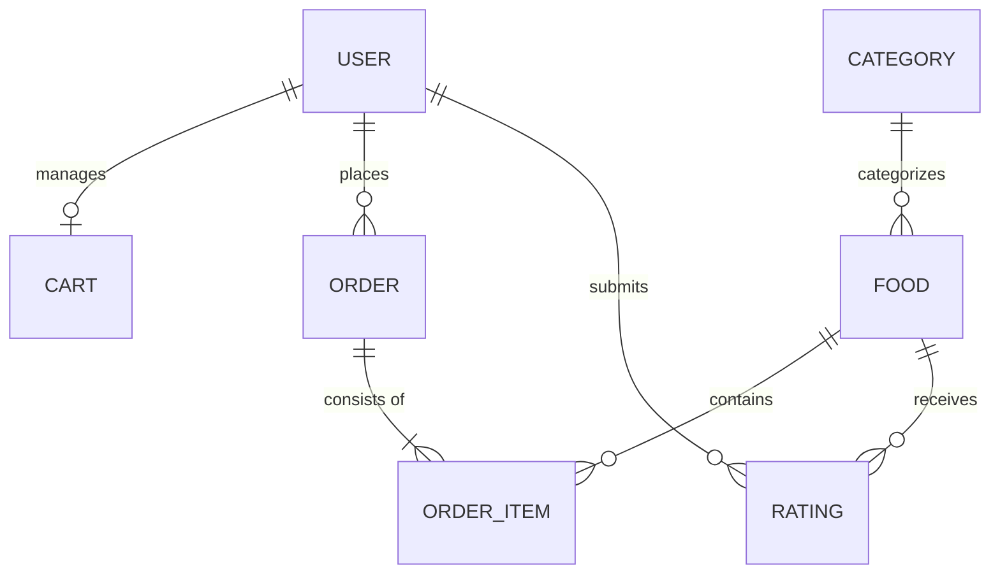
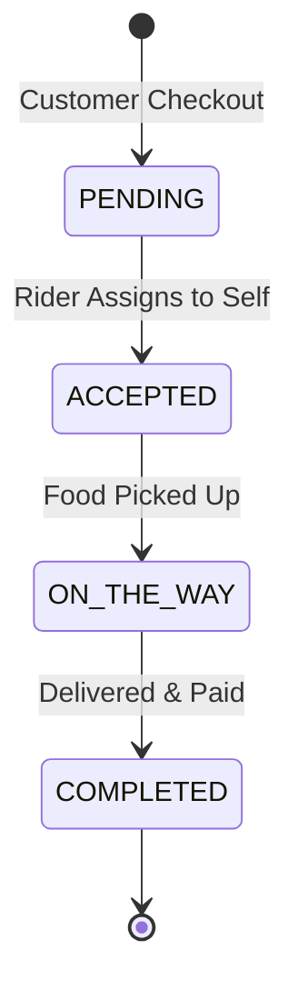

# 🍜 Khaja Kham - Smart Food Delivery & Logistics Ecosystem

[](https://www.djangoproject.com/)
[](https://scikit-learn.org/)
[](https://www.postgresql.org/)
[](https://www.python.org/)

**Khaja Kham** is a premium, full-stack food delivery ecosystem built with Django. It features a sophisticated recommendation engine powered by Machine Learning, real-time logistics tracking using OpenStreetMap (OSM) and Leaflet, and a robust order management system designed for scale.

---

## ✨ Key Features

-   🌐 **Smart User Dashboard**: Experience a seamless browsing experience with AJAX-powered cart functionality, advanced search, and dynamic food categorization.
-   🚴 **Rider Command Center**: Dedicated panel for delivery partners with shift management, live order tracking, and delivery fulfillment tools.
-   🧠 **ML-Powered Recommendations**: 
    -   *Collaborative Filtering*: Personalized suggestions based on user behavior (Cosine Similarity).
    -   *Market Basket Analysis*: Intelligent "Frequently Bought Together" prompts.
-   🗺️ **Real-time Geo-Logistics**: Integrated map systems using OpenStreetMap and Leaflet for rider tracking and delivery estimation without costly API fees.
-   ⭐ **Dynamic Reviews**: High-performance rating system with sentiment-aware review analysis.
-   💳 **Payment Integration Ready**: Architected for COD (Cash on Delivery), eSewa, and Khalti payment gateways.
-   ⚡ **Enterprise-Grade Architecture**: Decoupled application modules (Foods, Orders, Users, Recommendations) for high maintainability.

---

## 🛠️ Technology Stack

| Layer | Tools & Technologies |
| :--- | :--- |
| **Backend** | Django 4.2+, Django REST Framework, Python 3.10+ |
| **Frontend** | Vanilla JS (ES6+), Tailwind CSS, Lucide Icons, Leaflet.js |
| **Data & ML** | Scikit-Learn, NumPy, Pandas, Pillow (Image Processing) |
| **Geolocation** | OpenStreetMap (OSM), Leaflet |
| **Database** | SQLite (Dev) / PostgreSQL (Prod) |
| **Environment** | python-dotenv for secure configuration |

---

## 🏗️ Project Architecture & Data Flow

The system is built on a modular architecture that ensures scalability and separation of concerns.

### 📊 Database Schema (High-Level ERD)


### 🔄 Order Lifecycle Flow


---

## 🚀 Getting Started (Local Development)

Follow these steps to set up the engine on your machine.

### 1. Repository Setup
```bash
git clone <repository-url>
cd Khaja-Kham
```

### 2. Environment Initialization
Create a virtual environment to isolate project dependencies:
```bash
python -m venv venv
source venv/bin/activate  # Linux/Mac
# OR: venv\Scripts\activate (Windows)
```

Install core dependencies:
```bash
pip install -r requirements.txt
```

### 3. Configuration (`.env`)
Create a `.env` file in the root directory to manage your secrets:
```env
SECRET_KEY=yoursecretkeyhere
DEBUG=True
ALLOWED_HOSTS=localhost,127.0.0.1
GOOGLE_MAPS_API_KEY=your_key_here (optional for advanced maps)
```

### 4. Database Synchronization
Apply migrations to build the schema:
```bash
python manage.py makemigrations
python manage.py migrate
```

### 5. Seed Intelligence & Data
Khaja Kham comes with built-in scripts to populate your system with test data:
```bash
# Seed 25+ Nepali foods, categories, and test user accounts
python manage.py seed_dummy_data

# Train the Recommendation Engine (Matrices)
python manage.py train_recommendations
```

### 6. Ignition
Launch the development server:
```bash
python manage.py runserver
```
Access the application at: [http://127.0.0.1:8000](http://127.0.0.1:8000)

---

## 📂 Project Structure

```text
Khaja-Kham/
├── core/               # Main layout, utils, and custom commands
├── users/              # Custom User model (Admin, Rider, Customer)
├── foods/              # Menu management, Categories, Search logic
├── orders/             # Cart, Checkout, and Order processing
├── delivery/           # Rider dashboard and Logistics logic
├── recommendations/    # ML Similarity Matrix and suggestion engine
├── khaja_kham/         # Project heart (settings.py, urls.py)
├── templates/          # Global UI templates
├── media/              # Food images and user uploads
└── manage.py           # Django CLI entry point
```

---

## 🔑 Default Test Credentials

| Role | Username | Password |
| :--- | :--- | :--- |
| **Super Admin** | `admin` | `admin` |
| **Delivery Rider** | `rider` | `rider` |
| **Test Customer** | `user1` | `user1` |

---

## 📡 API Endpoints (REST API)

Khaja Kham provides a basic RESTful API for integrations (powered by DRF):

| Endpoint | Method | Description |
| :--- | :--- | :--- |
| `/api/categories/` | `GET` | List all food categories |
| `/api/foods/` | `GET` | List all available food items |
| `/api/orders/` | `GET/POST` | Order management (Authenticated) |
| `/api/cart/` | `GET` | View current user's cart |
| `/api/recommendations/personal/` | `GET` | Get ML-based personalized suggestions |
| `/api/recommendations/combos/` | `GET` | Get frequent food combinations |

---

## ☁️ Deployment Guidelines

For production environments, ensure you:
1. Set `DEBUG=False` in `.env`.
2. Configure **PostgreSQL** in `settings.py`.
3. Use **Gunicorn/Nginx** for serving static and media files.
4. Schedule `train_recommendations` via **Crontab** for daily pattern updates.

---

## 📄 License & Documentation
- For deep technical documentation, refer to [DOCUMENTATION.md](./DOCUMENTATION.md).
- Distributed under the MIT License. See `LICENSE` for more information.

---
*Created with ❤️ by the Khaja Kham Team*
